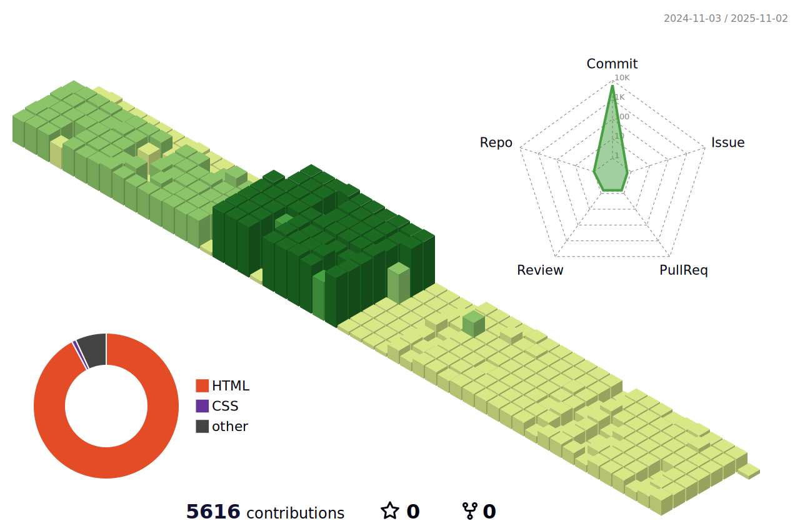

<!-- 카운터 시작 -->

<!-- 카운터 종료 -->

<!-- Welcom 시작 -->

   

<!-- Welcom 종료 -->

업데이트중 입니다

<!-- 뱃지 참고  -->
<!-- 뱃지 참고 https://simpleicons.org/?q=jupy -->

<!-- 파이썬 -->

<!-- 주피터 -->

<!-- 구글코랩 -->

<!-- MySQL -->

<!-- 깃허브 -->

<!-- 슬랙 -->

<!-- 노션 -->

<!-- 리눅스 -->

<!-- 구글클라우드 -->

<!-- HTML -->

<!-- CSS -->

<!-- 텐서플로 -->

<!-- 셀레늄 -->

<!-- 테블로 -->

<!-- 구글애널리틱스 -->

<!-- AutoCAD -->

<!-- Inventor -->

<!-- CATIA -->

<!-- Abaqus -->

<!-- ANSYS -->

<!-- 백준 티어 시작 -->
<!-- 참고 https://soo-vely-dev.tistory.com/159 -->
<!-- 참고 https://github.com/mazassumnida/mazassumnida -->
<!--  -->
<!-- 백준 티어 종료 -->

<!-- Most Used Languages 시작 -->
<!-- 참고 https://github.com/anuraghazra/github-readme-stats/blob/master/themes/README.md -->
<!-- 참고 https://80000coding.oopy.io/865f4b2a-5198-49e8-a173-0f893a4fed45 -->
<!-- https://github.com/anuraghazra/github-readme-stats -->

<!-- Most Used Languages 종료 -->

<!-- Github Stats 시작 -->
<!-- 참고 https://github.com/anuraghazra/github-readme-stats/blob/master/themes/README.md -->
<!-- 참고 https://80000coding.oopy.io/865f4b2a-5198-49e8-a173-0f893a4fed45 -->

<!-- Github Stats 종료 -->

<!-- 깃허브 꾸미기 -->
<!-- 참고 https://yermi.tistory.com/entry/%EA%BF%80%ED%8C%81-Github-Readme-%EC%98%88%EC%81%98%EA%B2%8C-%EA%BE%B8%EB%AF%B8%EA%B8%B0-Readme-Header-Badge-Widget-%EB%93%B1 -->

<!-- 아이콘 -->
<!-- 참고 https://simpleicons.org/ -->

<!-- 3D 잔디 시작 -->
<!-- 참고 티스토리 매뉴얼 https://h-owo-ld.tistory.com/264 -->
<!-- 참고 깃허브 https://github.com/yoshi389111/github-profile-3d-contrib#step-4-add-image-to-readmemd -->
<!-- 참고 오류 해결 방법 https://stackoverflow.com/questions/76023778/action-failed-with-the-process-usr-bin-git-failed-with-exit-code-128 -->

<!-- 3D 잔디 종료 -->

